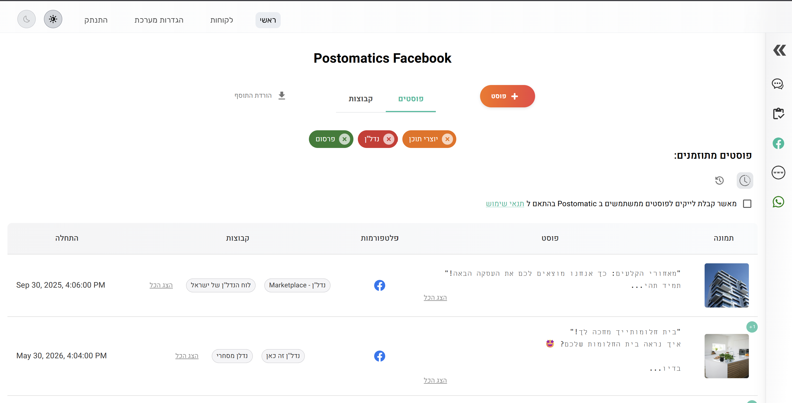
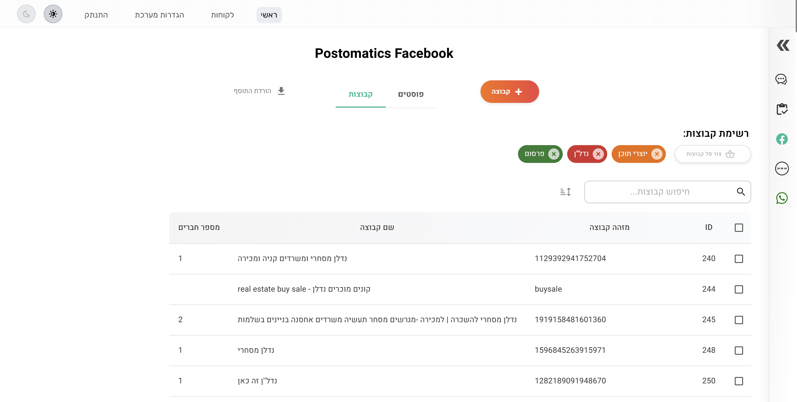
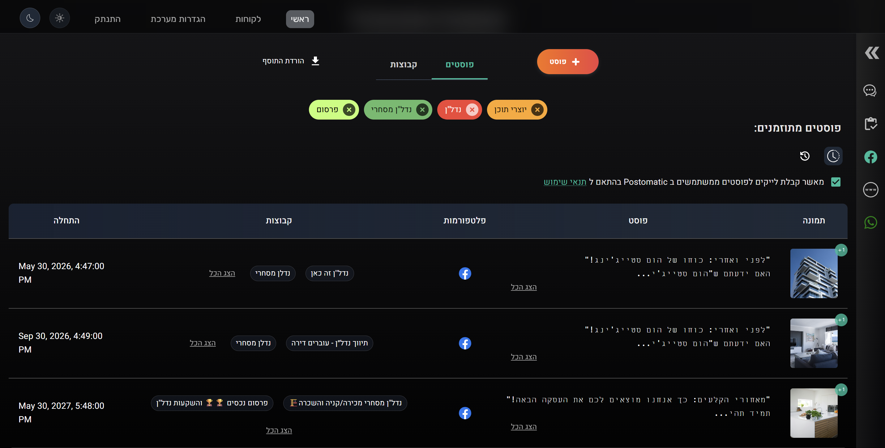
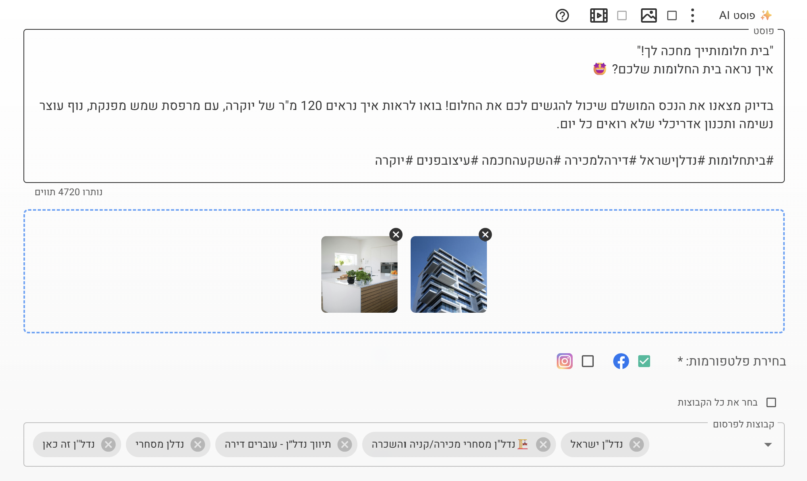
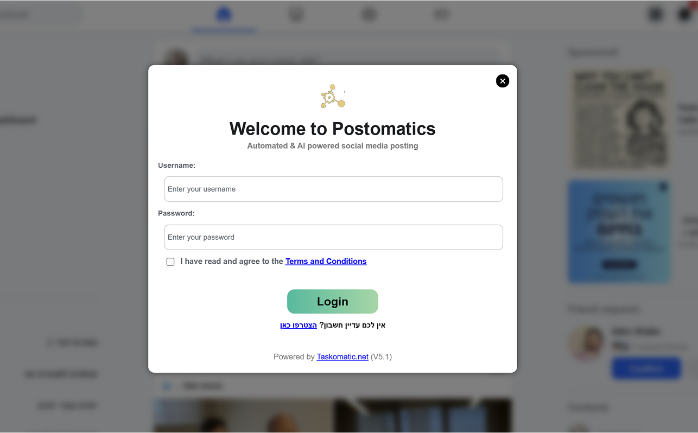

# 🚀 Postomatic

**AI-Powered Facebook Post Automation Tool**

## 📖 Overview

**Postomatic** is a powerful Chrome extension that automates Facebook posting with enhanced AI-powered content generation. It allows users to create and manage organic marketing campaigns across multiple Facebook groups with ease.

> ⚠️ **PRIVATE PROJECT**: This repository contains proprietary code and is not open-source. The original codebase is not shared publicly.

## 🖼️ Screenshots

  
  
<em>Post Management and Analytics</em>

  
  
<em>Groups Dashboard Interface</em>

  
  
  
<em>Post managment - dark theme</em>

  
  
<em>AI-Powered Content Creation</em>

   
   
<em>Extension - login screen</em>

    
    
<em>Extension - IDLE state</em>

## 🏗️ Architecture

Postomatic features a comprehensive multi-layer architecture:

1. **Chrome Extension**: Frontend interface built with Node.js, React, MUI, and Tailwind CSS
2. **Server-Side**: Python-based backend handling AI processing and business logic
3. **Admin Dashboard**: Management interface for campaigns, posts, and analytics
4. **Database Layer**: Utilizing both PostgreSQL and SQLite databases

## ⚙️ Technology Stack

- **Frontend**: React.js with MUI components and Tailwind CSS styling
- **Extension Core**: Node.js runtime environment
- **Backend Server**: Python with REST API endpoints
- **Primary Database**: PostgreSQL for robust data storage
- **Local Storage**: SQLite for extension-specific data
- **AI Integration**: OpenAI for content generation and enhancement

## ✨ Features

- AI-powered content generation and optimization
- Multi-group posting capability
- Campaign scheduling and management
- Organic content distribution strategies
- Advanced analytics and performance tracking
- Custom post templates and variations
- User-friendly administration dashboard

## 🔒 Privacy Note

This project is private and proprietary. The codebase contains sensitive business logic and is not intended for public distribution. All screenshots and implementation details are shared for demonstration purposes only.
